Paket som har använts i R för att köra kod
==========================================

    library(tidyverse)
    library(lubridate)
    library(lmtest)
    library(fastDummies)
    library(GGally)
    library(data.table)
    library(ggplot2)
    library(ggmap)
    library(gridExtra)
    library(forecast)
    library(tseries)
    library(zoo)
    library(astsa)
    library(FitARMA)
    library(MLmetrics)
    require(RColorBrewer)
    library(ltsa)

Inledning:
==========

I ett fjärrvärmesystem är värmebelastningsvariationen dels säsongbetonad
och daglig. Säsongsvariationer har i första hand ursprung i
utomhustemperatur under året. Men variationer i solljus och vind har en
påverkan. Dagliga variationer är främst orsakade av sociala mönster som
påverkar våra beteenden. Utomhustemperaturen spelar en viss roll under
de dagliga variationerna också då det är normalt sett kallare under
natten än på dagen. Dessa variationer leder till att kostnaderna ökar då
värmebelastningskapaciteten ökar.

Genom att få en mer god prognos över värmeefterfrågan underlättar det
för planering och drift för både produktionen samt distributionen då man
kan vidta åtgärder i förtid.

Syftet med detta arbete har varit att få en grundläggande bild över
flöde och energi för att göra träffsäkra prognoser. Dessa prognoser ska
vara träffsäkra mellan 1 till 48 timmar framåt i tiden. Frågeställningen
som vi valde för detta arbete var: Vilka modeller ger bäst prognoser
över data för flöde samt energi?

Data
====

Datamaterialet kommer från företaget Ferrologic som i sin tur har fått
datan från en kund som vill hållas anonym. Datamaterialet består av
tidsserier som är uppmätta timvis i 40 stycken närliggande hushåll
mellan datumen 2013/01/01 - 2017/06/26. Det är däremot endast 3 av dessa
hushåll som har mätningar från år 2013. På grund av detta har
datamaterialet avgränsats till datumen 2014/01/01 - 2017/06/26.

    data <- read_csv("dh-time-series-data.csv")
    rens.date <- data[data$date >= data$date[8761],c(1:3,7)]

Av de resterande 1 222 080 observationer finns det 29 stycken mätarfel,
där de är uppmätta värdena är ungefär 3 000 gånger större än de
resterande värdenas medelvärden. Mätarfelen har därför rättats till
medelvärdet för mätarfelets tid på dygnet, veckodag samt månad. Därefter
har observationerna aggregerats till varje observerad tidpunkt, vilket
ger en tidsserie med alla 40 hushålls summerade värden istället för 40
separata tidsserier.

    agg.flow <- aggregate(flow ~ date, data = rens.date, FUN = sum)
    agg.temp <- aggregate(temperatur ~ date, data = rens.date, FUN = mean)
    agg.power <- aggregate(power ~ date, data = rens.date, FUN = sum)
    flow.temp <- merge(agg.flow, agg.temp, by.x = "date", by.y = "date")
    alla <- merge(agg.power, flow.temp, by.x = "date", by.y = "date")

En värmemätare mäter volymflödet av fjärrvämevatten och
temperaturdifferensen mellan framledning och returledning. Det som ofta
i dagligt tal kallas flöde är egentligen en volym som passerat
fjärrvärmecentralen under en timme. Energi som använts beräknas sedan i
integreringsverket enligt:
*E* = *ρ* \* *V* \* *C**p* \* *Δ**T*
 Där *E* är energin, *ρ* vattnets densitet, *V* vattenvolym som passerar
mätaren, *C**p* vattnets värmekapacitet och *Δ**T*
temperaturskillnaden mellan fram- och returledningen.

Temperatur är uppmätt i en väderstation som är densamma för de 40
hushållen. Det är detsamma för alla hushåll då stationen som har gjort
mätningarna är den närmaste.

Nya variabler som har även valt att skapas, med hjälp av datumen har
dummyvariabler skapats för de olika månaderna, timmarna på dygnet samt
veckodag och helgdag. Dessa har skapats i hopp om att förklara
variationen under året och dagarna om inte temperatur kan förklara allt.
Detta görs även i hopp om att fånga upp den sociala aspekten, att det
förbrukas mer under timmarna och dagarna som personer tenderar att vara
hemma på.

    ## Standardiserar temperatur för att göra en modell som är enklare att förklara
    alla$temperatur <- scale(alla$temperatur, center = TRUE, scale = TRUE)
    ## Lägger till dummies för månader som kan användas i modeller
    months <- data.frame("month" = c(month(as.POSIXlt(alla$date, format="%d/%m/%Y"))))
    dummies.months <- dummy_cols(months)
    colnames(dummies.months) <- c("month", "Jan", "Feb", "Mar", "Apr", "May", "Jun", 
                                  "Jul", "Aug", "Sep", "Oct", "Nov", "Dec")
    alla.dummies <- cbind(alla, dummies.months[,2:13])
    ## Testar tid som dummies
    hours <- data.frame("hour" = c(rep(c(0:23), 1273)))
    dummies.hours <- dummy_cols(hours)
    colnames(dummies.hours) <- c("hour", "0", "1", "2", "3", "4", "5", "6", "7", "8", "9", "10", "11", "12", "13",
                                 "14", "15", "16", "17", "18", "19", "20", "21", "22", "23")
    alla.hours <- cbind(alla.dummies, dummies.hours[,2:25])
    ## Veckodagar skapas
    dagar <- as.data.frame(weekdays(as.Date(alla$date)))
    dummies.dagar <- dummy_cols(dagar)
    colnames(dummies.dagar) <- c("dag", "Fre", "Lör", "Mån", "Ons", "Sön", "Tis", "Tor")
    alla.hours$Helgdag <- c(dummies.dagar$Lör + dummies.dagar$Sön)

Datamaterialet har delats upp i två delar, där en del är träningsdata
med 29 064 observationer (95 procent) och en del med testdata med 1 488
observationer (5 procent). Träningsdata kommer att användas för att
skatta de olika modellerna som kommer att användas och testdata kommer
att använda för att utvärdera hur bra de skattade modellerna är
anpassade till ny data. Uppdelningen mellan de två är att
observationerna från de sista två månaderna tillhör testdata och
resterande tillhör träningsdata.

    tr.data <- alla.hours[1:29064,]
    veri.data <- alla.hours[29065:30552,]

    ggplot(alla) +
      aes(x = date, y = power) +
      geom_line(color = "dark orange") +
      theme_bw() +
      labs(title = "Energi över tid", y = "Energi", x = "Datum") +
      theme(axis.title.y = element_text(size = 11, face = "bold"),
            axis.title.x = element_text(size = 11, hjust = 0.48, face = "bold"),
            plot.title = element_text(hjust = 0.48, size = 14, face = "bold"))

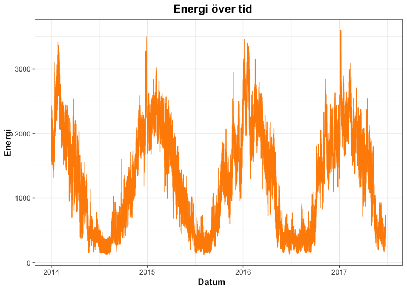

Ovan visar figuren den totala energiförbrukningen för de 40 hushållen
för varje observerad timme i tidsintervallet. En kan se att det finns
tydliga mönster där mer energi mäts under vinterhalvåret än
sommarhalvåret.

    ggplot(alla[3481:(3481+167),]) +
      aes(x = date, y = power) +
      geom_line(color = "dark orange") +
      theme_bw() +
      labs(title = "Energi en vecka", y = "Energi", x = "Datum") +
      theme(axis.title.y = element_text(size = 11, face = "bold"),
            axis.title.x = element_text(size = 11, hjust = 0.48, face = "bold"),
            plot.title = element_text(hjust = 0.48, size = 14, face = "bold"))

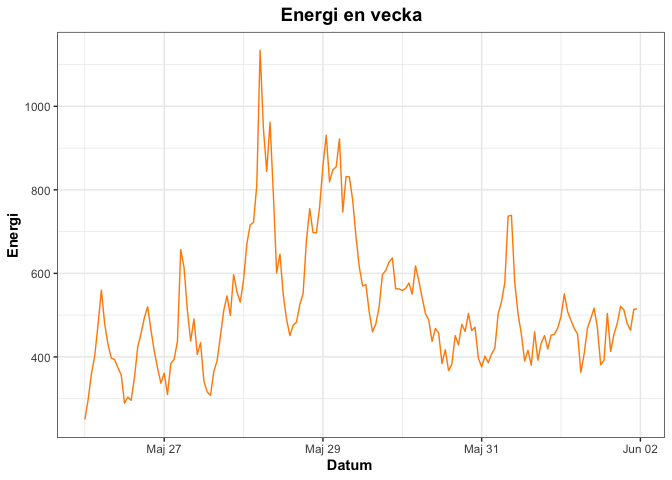

Figuren visar energiförbrukiningen för de 40 hushållen under en vecka.
Vi kan se att det finns dagliga mönster, där energiförbrukningen går upp
under morgonen och kvällen och är mindre under dagen.

    ggplot(alla) +
      aes(x = date, y = flow) +
      geom_line(color = "dark orange") +
      theme_bw() +
      labs(title = "Flöde över tid", y = "Flöde", x = "Datum") +
      theme(axis.title.y = element_text(size = 11, face = "bold"),
            axis.title.x = element_text(size = 11, hjust = 0.48, face = "bold"),
            plot.title = element_text(hjust = 0.48, size = 14, face = "bold"))

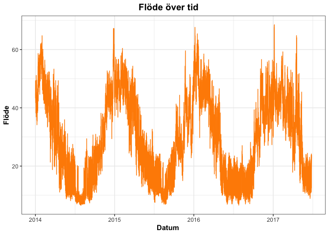

Ovan visar figuren det totala flödet för de 40 hushållen för varje
observerad timme i tidsintervallet. Figuren visar att det finns tydliga
mönster precis som i första figuren, det är ett större flöde under
vinterhalvåret än sommarhalvåret.

    ggplot(alla[3481:(3481+167),]) +
      aes(x = date, y = flow) +
      geom_line(color = "dark orange") +
      theme_bw() +
      labs(title = "Flöde en vecka", y = "Flöde", x = "Datum") +
      theme(axis.title.y = element_text(size = 11, face = "bold"),
            axis.title.x = element_text(size = 11, hjust = 0.48, face = "bold"),
            plot.title = element_text(hjust = 0.48, size = 14, face = "bold"))

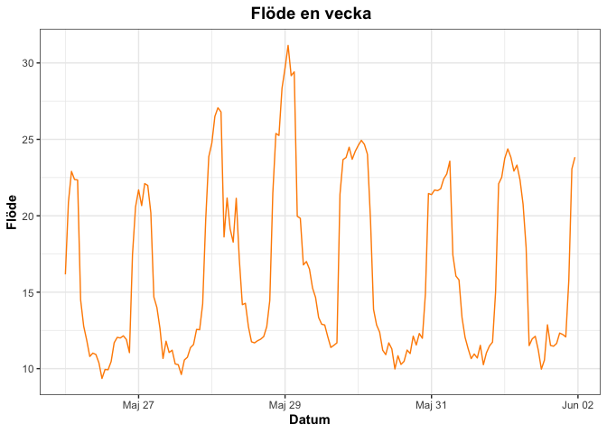

Figuren visar det uppmätta flödet för samma vecka som för energi veckan.
Vi kan se att det finns ett tydligt dagligt mönster, där flödet är högre
under nätterna samt morgonen än vad det är under dagen och kvällen.

    ggplot(alla) +
      aes(x = date, y = temperatur) +
      geom_line(color = "dark orange") +
      theme_bw() +
      labs(title = "Temperatur över tid", y = "Temperatur", x = "Datum") +
      theme(axis.title.y = element_text(size = 11, face = "bold"),
            axis.title.x = element_text(size = 11, hjust = 0.48, face = "bold"),
            plot.title = element_text(hjust = 0.48, size = 14, face = "bold"))

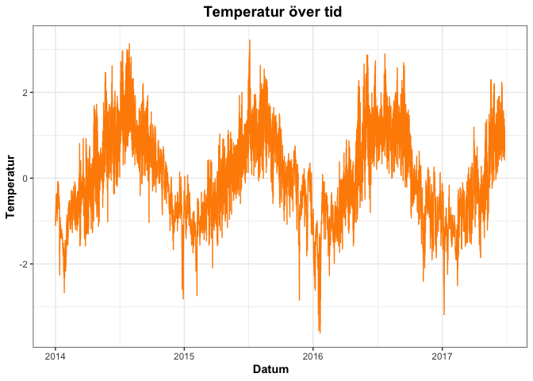

Figuren visar temperaturen som har uppmätts vid en mätstation som är
närliggande vid de 40 hushållen. Även för temperatur finns det ett
starkt säsongsmönster, men som är högre under sommarhalvåret och lägre
under vinterhalvåret.

    ggplot(alla[3481:(3481+167),]) +
      aes(x = date, y = temperatur) +
      geom_line(color = "dark orange") +
      theme_bw() +
      labs(title = "Temperatur en vecka", y = "Temperatur", x = "Datum") +
      theme(axis.title.y = element_text(size = 11, face = "bold"),
            axis.title.x = element_text(size = 11, hjust = 0.48, face = "bold"),
            plot.title = element_text(hjust = 0.48, size = 14, face = "bold"))

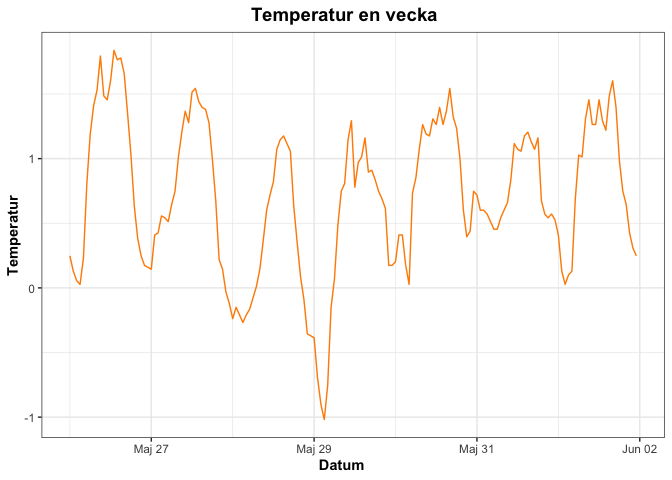

Figuren visar den uppmätta temperaturen vid mätstationen under samma
vecka som veckofigurerna för flöde och energi. En kan se att det är
högre temperaturer under dagen än vad det är under de resterande
timmarna.

    alla.dummies$timmar <- rep(c(0:23),1273)
    medel.timme <- aggregate(alla.dummies$flow, by = list(alla.dummies$timmar), FUN = "mean")

    ggplot(medel.timme,aes(Group.1,x)) + 
      geom_line(col="darkorange") + 
      theme_bw() + 
      labs(title = "Medelvärdet på flöde för varje timme", x="Timmar",y="Flöde") + 
      scale_x_discrete(limits = c(0:23)) + 
      scale_y_discrete(limits = c(26:33)) +
      theme(axis.title.y = element_text(size = 11, face = "bold"),
            axis.title.x = element_text(size = 11, hjust = 0.48, face = "bold"),
            plot.title = element_text(hjust = 0.48, size = 14, face = "bold"),
            panel.grid = element_blank())

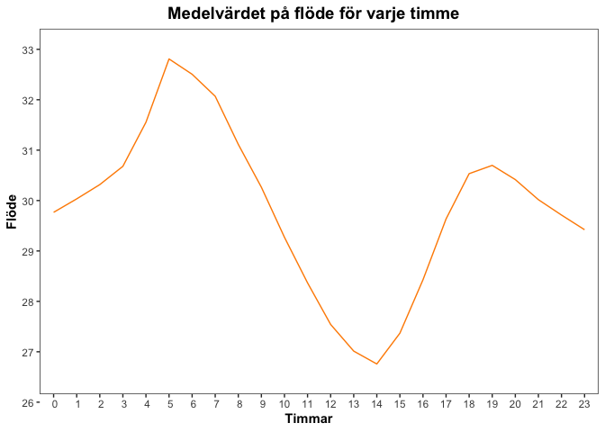

Figuren visar dagliga variation för flödes medelvärden. Som synes i
figuren visar att flöde är som högst på morgonen. vi kan även se att
medelvärdet för flödet är som minst mitt på dagen. Framåt kvällen går
flödet åter upp igen dock inte lika högt som på morgonen.

    medel.energi <- aggregate(alla.dummies$power, by=list(alla.dummies$timmar),FUN = "mean")
    ggplot(medel.energi,aes(Group.1,x)) + 
      geom_line(col="darkorange") + 
      theme_bw() + 
      labs(title = "Medelvärdet på energi för varje timme", x="Timmar",y="Energi") + 
      scale_x_discrete(limits = c(0:23)) + 
      theme(axis.title.y = element_text(size = 11, face = "bold"),
            axis.title.x = element_text(size = 11, hjust = 0.48, face = "bold"),
            plot.title = element_text(hjust = 0.48, size = 14, face = "bold"),
            panel.grid = element_blank())

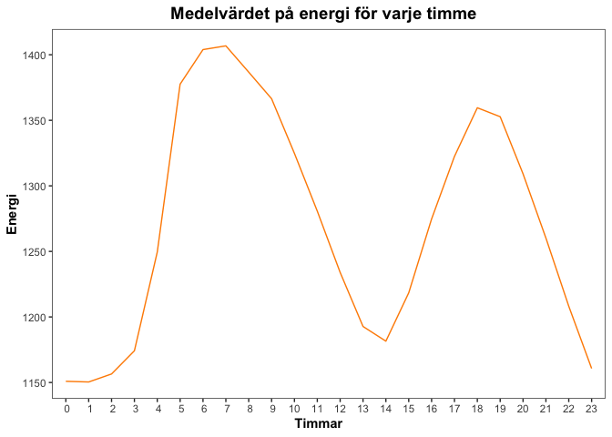

Figuren visar dagliga variationen för energi medelvärden. En kan se i
figuren att topparna är under morgonen och kvällen. Dalarna är under
natten och dagen.

    m_manad <- data.frame(Manad = factor(c("Jan","Feb","Mar","Apr","Maj",
                                           "Jun","Jul","Aug","Sep","Okt","Nov","Dec")),
                          value = c(48.52209,46.19534,40.30827,32.08739,20.67763,16.44187,13.48558,
                                    12.84579,16.40351,25.95641,35.81544,41.65596))
    m_manad$Manad = factor(m_manad$Manad, levels = c("Jan","Feb","Mar","Apr","Maj","Jun","Jul","Aug","Sep","Okt","Nov","Dec"))
    ggplot(m_manad,aes(Manad,value,group = 1)) + 
      geom_line(col="darkorange") + 
      theme_bw() + 
      labs(title = "Medelvärdet på flöde för varje månad", x="Månad",y="Flöde") +
      theme(axis.title.y = element_text(size = 11, face = "bold"),
            axis.title.x = element_text(size = 11, hjust = 0.48, face = "bold"),
            plot.title = element_text(hjust = 0.48, size = 14, face = "bold"),
            panel.grid = element_blank())

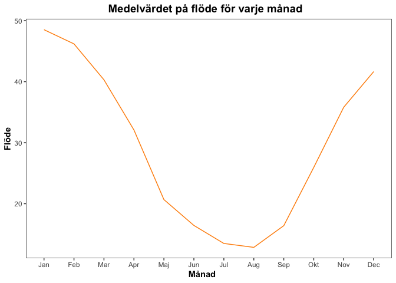

Figuren beskriver säsongsvariationen för flödes medelvärden för olika
månader. Figuren visar att under vintern är flödes medelvärde som högst
och under sommaren är den som minst.

    medel.manad <- aggregate(alla.dummies$power, by= list(months.POSIXt(alla.dummies$date)), FUN ="mean")
    m_m.energi <- data.frame(Manad = factor(c("Jan","Feb","Mar","Apr","Maj",
                                              "Jun","Jul","Aug","Sep","Okt","Nov","Dec")),
                             value = c(2357.3206,2189.2028,1831.0262,1377.7309,780.0914,461.1756,329.5520,
                                       350.8056,512.0449,1146.7334,1596.2037,1892.1039))
    m_m.energi$Manad <-  factor(m_m.energi$Manad, levels = c("Jan","Feb","Mar","Apr","Maj",
                                                             "Jun","Jul","Aug","Sep","Okt","Nov","Dec"))
    ggplot(m_m.energi,aes(Manad,value,group=1)) + 
      geom_line(col="darkorange") + 
      theme_bw() + 
      labs(title = "Medelvärdet på energi för varje månad", x="Månad",y="Energi") + 
      theme(axis.title.y = element_text(size = 11, face = "bold"),
            axis.title.x = element_text(size = 11, hjust = 0.48, face = "bold"),
            plot.title = element_text(hjust = 0.48, size = 14, face = "bold"),
            panel.grid = element_blank())

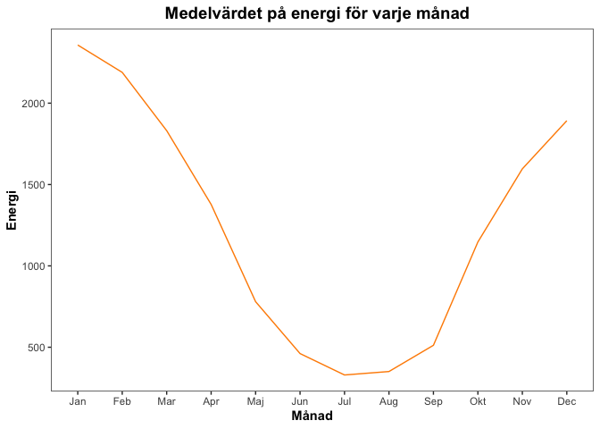

Figuren beskriver hur medelvärdet för energi säsongsvariation ser ut
olika månader. Som synes i figuren visas liknande mönster som för
figuren innan, där det går åt mer energi under vintern jämfört med
sommaren.

    medel.veckodagar.f <- aggregate(alla.dummies$flow, by=list(weekdays.POSIXt(alla.dummies$date)),FUN ="mean")
    medel.veckodagar.f$Group.1 <- factor(medel.veckodagar.f$Group.1, levels = c("Måndag", "Tisdag", "Onsdag",
                                                                                "Torsdag","Fredag", "Lördag","Söndag"))
    ggplot(medel.veckodagar.f,aes(Group.1,x)) + 
      geom_line(color="darkorange",group=1) +
      theme_bw() + 
      labs(title = "Medelvärdet på flöde för varje veckodag", x="Veckodag",y="Flöde") +
      theme(axis.title.y = element_text(size = 11, face = "bold"),
            axis.title.x = element_text(size = 11, hjust = 0.48, face = "bold"),
            plot.title = element_text(hjust = 0.48, size = 14, face = "bold"),
            panel.grid = element_blank())

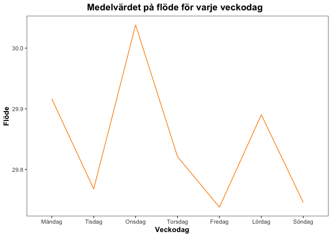

Figuren förklarar hur medelvärdena ser ut under veckodagar för flöde. Vi
kan se att det inte finns något tydligt mönster hur flödet förändras
under en vecka. Onsdagen är dagen som har högst medelvärde medans fredag
och söndag är de dagarna med minst medelvärde för flöde.

    medel.veckodagar.e <- aggregate(alla.dummies$power, by=list(weekdays.POSIXt(alla.dummies$date)),FUN ="mean")
    energi_medel_veckodag <- aggregate(alla.dummies$power, by = list(weekdays.POSIXt(alla.dummies$date)), FUN = "mean")
    energi_medel_veckodag$Group.1 <- factor(energi_medel_veckodag$Group.1, levels = c("Måndag", "Tisdag", "Onsdag",
                                                                                      "Torsdag","Fredag", "Lördag","Söndag"))
    ggplot(energi_medel_veckodag,aes(Group.1,x)) + 
      geom_line(color="darkorange",group=1) +
      theme_bw() + 
      labs(title = "Medelvärdet på energi för varje veckodag", x="Veckodag",y="Energi") +
      theme(axis.title.y = element_text(size = 11, face = "bold"),
            axis.title.x = element_text(size = 11, hjust = 0.48, face = "bold"),
            plot.title = element_text(hjust = 0.48, size = 14, face = "bold"),
            panel.grid = element_blank())

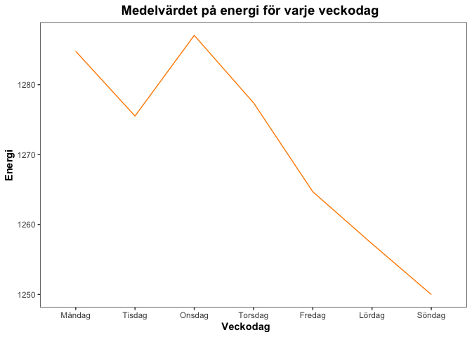

Figuren visar hur medelvärdena förändras under veckodagarna för energi.
Energianvändningen visar att måndag till torsdag håller en liknande
nivå. Fredag till söndag visar att medelvärdena för energi sjunker.

Metod
=====

I följande kapitel beskrivs alla modeller som har använts för att få
fram resultatet i den här uppsatsen. För att beräkna alla följande
metoder har programmet R använts.

Multipel linjär regression
--------------------------

Multipel linjär regression används för att kunna se linjära samband
mellan en responsvariabel och två eller fler oberoende förklarande
variabler. I den här uppsatsen kommer den användas för att se samband
mellan flöde/energi och bakgrundsvariabler som har tagits fram. Modellen
för multipel linjär regression ser ut som följande:

*y**i* = *β*0 + *β*1*x**i*, 1 + ... + *β**p* − 1*x**i*, *p* − 1 + *ϵ**i*.

Då regressionsparametrarna
*β*0, *β*1, …, *β**p* är okända,
betecknas de skattade regressionsparametrarna med **b**. Då
*E*\[**Y**\] = **X****β** medför det att
$\\hat{\\mathbf{Y}} = \\mathbf{X}\\mathbf{b}$. **b** kan därmed skattas
med minsta kvadratmetoden :

**b** = (**X**′**X**) − 1**X**′**Y**.

Residualerna beräknas sedan med formeln :
$$\\underset{n \\times 1}{\\mathbf{e}} = \\mathbf{Y} - \\hat{\\mathbf{Y}} = \\mathbf{Y} - \\mathbf{X}\\mathbf{b}.$$
 Där **Y** är en vektor av responser och **X** är en matris av
prediktionsvariabler.

    ## Funktionen för att skatta linjära regressionsmodellerna är:
    lm()
    ## Den ger även utvärderingsmåtten som beskrivs nedan.

### Förklaringsgrad

Förklaringsgraden som betecknas *R**p*2 är ett
utvärderingsmått som beräknas med hjälp av *S**E**E**p* och
*S**S**T**O* med formeln:

$$R^2\_p = 1 -\\frac{SEE\_p}{SSTO}.$$

där *S**S**E**p* och *S**S**T**O* beräknas med hjälp av
formlerna:

*S**S**E**p* = **Y**′**Y** − **b**′**X**′**Y**.
$$SSTO = \\mathbf{Y}' \\mathbf{Y} - (\\frac{1}{n}) \\mathbf{Y}' \\mathbf{J} \\mathbf{Y}.$$

där **J** är en *n* × *n* matris med ettor.

Då *S**S**T**O* är en konstant för alla möjliga modeller som konstrueras
för ett givet datamaterial så är det modellen med lägst
*S**S**E**p* som kommer att ge det högsta
*R**p*2 värdet. Då *R**p*2
inte kan minska då ytterligare X variabler läggs till kommer det
maximala *R**p*2 värdet vara modellen med alla
*p* − 1 potentiella x-variabler. Detta betyder att
*R**p*2 är ett utvärderingsmått och kan inte
användas för att jämföra olika modeller.

### Justerad förklaringsgrad

Som nämns ovan så kan *R**p*2 inte minska då antal
variabler ökar. Den alternativa formeln, justerad förklaringsgrad,
*R**a*, *p*2, gör det och kan därför användas för
att jämföra modeller för att se om en variabel bidrar till att modellen
ger bättre prediktioner eller ej.

*R**a*, *p*2 beräknas med formeln:

$$R^2\_{a,p} = 1 - (\\frac{n-1}{n-p}) \\frac{SSE\_p}{SSTO} = 1- \\frac{\\frac{MSE\_p}{SSTO}}{n-1}.$$

Där *M**S**E**p* beräknas med hjälp av
*S**S**E**p* med formeln:

$$MSE\_p = \\frac{SSE\_p}{n-p}.$$

Detta gör att modellen med högst *R**a*, *p*2
värde är en modell som inte har några onödiga x-variabler. Den bästa
modellen med enligt denna formel är den med högst
*R**a*, *p*2 värde.

ARMA modell kombinerat med linjär regression
--------------------------------------------

En autoregressiv modell (AR) modellerar det nuvarande värdet i
tidsserien baserat på tidigare observationer av tidsserien. En glidande
medelvärde modell (MA) är en linjär regression av det nuvarande värdet
av tidsserien mot de tidigare värdena av residualerna. ARMA kombinerar
både AR och MA modellerna, som defineras ARMA(p, q), där p och q är
ordningen av AR respektive MA modellerna. ARMA(p, q) kan även kombineras
med exogena faktorer (linjär regression), som defineras ARMAX(p, q, b).
Med denna modell så blir ARMA komponenten modellerad på den linjära
regressionens residualer. Modellen ser ut som följande:

$$y\_t = \\delta + \\sum\\limits^p\_{i=1}\\varphi\_i y\_{t-i} + \\sum\\limits^q\_{j=1}\\theta\_j \\epsilon\_{t-j} + \\sum\\limits^b\_{k=1}\\eta\_k x\_{t-k+1} + \\epsilon\_t.$$

där *y**t* är det observerade värdet vid tidpunkt *t* från
tidsserien {*y**t*|1, 2, …, *N*}, *δ* är en konstant,
*φ**i* är den *i*te autoregressiva koefficienten,
*θ**j* är den *j*te glidande medelvärde koefficienten, och
*e**t* är feltermen vid tidpunkt *t*, där
*e**t* ∼ *N*(0, *σ*2), och är icke korrelerad med
tidigare med alla tidigare. *b* och *η**k* representerar lag
och koefficienten för den exogena variabeln. För att skatta dessa
modeller så används maximum likelihood.

I arbetet har vi valt att avgränsa oss och endast använda oss av AR
delen av ARMA, då ARMA ärfördelaktigt när man har oobserverande chocker
i data, där det glidande medelvärdet (MA) tar hänsyntill detta. Då detta
inte har upptäcks så använder vi ej MA delen. De antaganden för
tidserien somautoregressiva modeller behöver uppfylla är att medelvärdet
behöver vara lika med noll, den måste även vara svagt stationär.

    ## funktionen som används för att skatta AR modellen är:
    ARIMA()

### Val av modell

En modell kan bli överanpassad då man lägger till nya parameterar
eftersom likelihoodfunktionen ökar när modellen blir alltmer komplex.
Att överanpassa data för prognoser kommer resultera i att modellen har
lärt sig träningsdatan för bra och därmed blir dålig på att prognositera
på ny data som tillkommer. BIC tar hänsyn till problemet genom att lägga
till en straffterm för antalet parameterar i modellen där Strafftermen
växer med antalet observationer. För att komma fram till den AR modell
som anpassar sig bäst till den givna tidsserier så används Bayesian
information criterion (BIC) för att jämföra skattade AR modeller och
därmed välja ut den bäst anpassade modellen. Värdet man får ut från BIC
föredras att vara lågt. Funktionen ser ut som följande:

*B**I**C* = *l**n*(*n*) \* *k* − *l**n*(*L̂*).

Där *l**n*(*L̂*) är den maximala log-likelihooden för den skattade
modellen, *n* är antalet observationer i tidsserien och *k* är antalet
skattade parametrar för modellen.

    ## Funktionen som har använts för att skatta den bästa AR modellen är:
    ar(tidsserie, AIC = TRUE, order.max = 48, method = "yule-walker")
    ## Funktionen skattar alla AR med metoden yule-walker. Därefter så jämförs alla AR modellers BIC värden.

### Itererad h-step ahead forecast

När man har skattat parameterarna från den kombinerade modellen, kan den
användas för prognoser till ett godtyckligt antal nummer av perioder i
framtiden. Genom att använda sig av träningsdata och sedan kunna bedöma
träffsäkerheten på verifieringsdatan. Eftersom verifieringsdatan inte
används för att välja prognoserna, borde den ge en bra indikation på hur
träffsäker modellen kommer vara på ny data. Itererad h-step ahead
forecast går till genom upprepningar av h gånger i en one-step ahead
prognos. När prognosen har estimerat framtida värdet matas värdet sedan
tillbaka som en ingång till nästa prognos. Processen upprepas tills
horisonten H är nådd. Formeln ser ut som följande:

$$y\_{t+h} = \\delta + \\sum^p\_{i=1} \\varphi\_i y\_{t+1-i}+  \\epsilon\_{t+h}.$$

Där, $h=1,\\dotsc,H$ och $t=1,\\dotsc,N-H$.

    ## Fukntionen som har använts för att skatta itererad h-step ahead forecast är:
    n_step <- function(fit, timmar, mydata, n, start){
      t <- matrix(ncol = n, nrow = timmar, 0)
      for (j in 1:timmar){
        for (i in 1:(n+1-j)){
          fit_a <- Arima(mydata[1:(start+i)], model=fit)
          t[j,(i+j-1)] <- forecast(fit_a, h=j)$mean[j]
        }
      }
      return(t)
    }

### Autokovarians

Autokovarians funktionen används för att kunna göra jämförelser mellan
den empiriska autokovariansen och den teoretiska autokovariansen.

#### Empirisk autokvarians

Kovarians är ett mått på linjära beroenden mellan två stycken
stokastiska slumpvariabler. Uppskattningen av autokovariansen är baserad
på att ersätta gruppmedelvärdet med tidsgenomsnittet. Autokovariansen
liknar autokorrelationen dock är den svårare att tolka, därför kommer vi
använda oss av spektraltäthet för att underlätta tolkningar. För
autokorrelationen går intervallen mellan -1 till 1 medans
autokovariansen går mellan  − ∞ till  + ∞. Formeln ges av:
*γ*(*s*) = *c**o**v*(*Y**t*, *Y**t* − *s*) = *E*\[(*Y**t* − *μ**t*)(*Y**s* − *μ**s*)\].
 där *t*, *s* = 0,  ± 1,  ± 2, …

    ## Funktionen som används för att beräkna empirisk autokovarians är:
    tacvfARMA()

#### Teoretisk autokovarians för AR-processer

Teoretiska autokovariansen beräknar den ”riktiga” autokovariansen på den
kombinerande modellen.Eftersom brus tillkommer i den teoretiska
autokovariansen är det egentligen inte den riktiga autokovariansen.

    ## Funktionen som används för att beräkna den teoretiska autokovariansen är:
    acf()

### Spektraltätheter

I många fall finns periodiska mönster i en tidsserie dock så kan
periodiska mönster vara väldigt komplexa och svåra att hitta.
Spektralanalys är en teknik för att kunna hitta dessa underliggande
periodiska mönstrerna som sker regelbundet, detta kan förknippas med
återkommande processer. Spektraltätheter fångar tidseriernas egenskaper
med hjälp av att den sönderdelar dessa till trigonometriska funktioner
för varje frekvens genom att representera funktionerna med styrkan hos
varje periodisk komponent. Detta medgör att tolkningen och utvärderingen
av modellen blir enklare. När man tolkar spektraltäthets grafer
indikerar en smal och hög topp på att det finns ett starkt periodiskt
mönster för den frekvens som toppen är centrerad kring. Ifall toppen är
lägre eller bredare indikerar detta på ett mer oklart periodiskt mönster
för den frekvensen. En hög topp nära noll (på x-axeln) indikerar på att
det finns en stark positiv korrelation mellan de närliggande tidpunkter
och data varierar mjukt över tiden. Skulle värden vara nära noll betyder
det att de har väldigt låga frekvenser och kan liknas vid långsamma
trender i data. Funktionen ser ut som följande för en generell AR(p):

$$S(f) = \\frac{\\sigma^2\_e}{1+ \\sum\\limits^p\_{i=1} \\varphi\_i^2 - 2\\varphi\_i cos(2\\pi f)}.$$

där *σ**e*2 är variansen, *π* är 3.14 och *f* är
fourier transformationen.

    ## Funktionen som används för att beräkna spektraltätheten är:
    spec.ar()

Jämförelsemått mellan modeller
------------------------------

För att utvärdera vilken modell som är den bästa att prediktera nya
värden så kommer träffsäkerheten av skattningarna mätas på testdata.
h-step ahead kommer att användas för att skatta 1 till och med 48 timmar
framåt från den sista observationen i träningsdata, till den sista
observationen i testdata. För att utvärdera dessa skattningar och
jämföra modeller kan flera olika metoder användas, men tre
jämförelsemått som ofta används är:

Mean absolute percentage error, förkortat som MAPE.
$$MAPE = (\\frac{1}{N}\\sum\\limits^N\_{t=1} (\\frac{|\\hat{y}\_t-y\_t|}{y\_t} ))\*100\\%.$$

Root mean square error, förkortat som RMSE.
$$RMSE = \\sqrt{\\frac{1}{N}\\sum\\limits^N\_{t=1}(\\hat{y}\_t-y\_t)^2 }.$$

    ## Funktionen som används för att beräkna RMSE på den itererad h-step ahead forecast är:
    rmse_func <- function(t, timmar, mydata, n, start, slut, pred){
      rmse_vec <- numeric(timmar)
      for (j in 1:timmar){
        rmse_vec[j] <- RMSE(( pred[j:n] - t[j,(j:n)]  ), mydata[(start+j):slut])
      }
      return(rmse_vec)
    }

Theils inequality coefficent, förkortat som TIC.

$$TIC = \\frac{\\sqrt{\\frac{1}{N} \\sum^N\_{t=1} (\\hat{y}\_t-y\_t)^2}}{\\sqrt{\\frac{1}{N} \\sum^N\_{t=1} y\_t^2} + \\sqrt{\\frac{1}{N} \\sum^N\_{t=1} \\hat{y}\_t^2}}.$$

    ## Funktionen som används för att beräkna TIC på den itererad h-step ahead forecast är:
    tic_func <- function(t, timmar, mydata, n, start, slut, pred){
      tic_vec <- numeric(timmar)
      for (j in 1:timmar){
        tic_vec[j] <- sqrt((1/(n + 1 - j)) * sum( (( pred[j:n] - t[j,(j:n)]  ) - mydata[(start+j):slut])^2)) /
          (sqrt( (1 / (n + 1 - j)) * sum((( pred[j:n] - t[j,(j:n)]  ))^2)) + 
             sqrt( (1 / (n + 1 - j)) * sum((mydata[(start+j):slut])^2)))
      }
      return(tic_vec)
    }

där *ŷ**t* är det predikterade värdet för *y* i tid *t*,
*y**t* är det faktiska värdet i tid *t*, *N* är antalet
observationer som predikteras. I alla tre modeller är mindre värden att
föredra, men de skiljer sig lite emellan. Ackuratessen RMSE är beroende
på skalan av variabeln. Däremot är varken MAPE eller TIC det, där TIC
kan anta ett värde mellan 0 och 1, då den är 0 om prediktionerna är
exakt som de faktiska värdena. Och MAPE är den genomsnittliga
procentuella skillnaden från det skattade värdet och det observerade.

En nackdel med MAPE kriteriet är att små faktiska värden kan ha stor
effekt. Om det faktiska värdet är litet, så kommer MAPE bli väldigt
stort även om skillnaden mellan det skattade värdet är litet. Av den
anledningen används en justerad MAPE, adjusted mean absolute percentage
error som förkortas till AMAPE.
$$ AMAPE = ( \\frac{1}{N} \\sum\\limits^N\_{t=1} ( \\frac{|\\hat{y}\_t - y\_t|}{\\frac{1}{N}\\sum^N\_{t=1}y\_t})) \*100\\% .$$

    ## Funktionen som används för att beräkna AMAPE på den itererad h-step ahead forecast är:
    amape_func <- function(t, timmar, mydata, n, start, slut, pred){
      amape_vec <- numeric(timmar)
      for (j in 1:timmar){
        amape_vec[j] <- ((1/(n+1-j)) * sum(abs(( pred[j:n] - t[j,(j:n)]  ) - mydata[(start+j):slut])  /
                                             ((1 / (n+1-j)) * sum(mydata[(start+j):slut])))) * 100
      }
      return(amape_vec)
    }

Resultat
========

För att få fram den bästa modellen som kan prediktera flöde respektive
energi, så har de variabler som beskrivits i data kapitlet undersökts om
de kan förklara variationen av respektive responsvariabel. Dessa
förklaringsvariabler är:

Temperatur, som är den uppmätta temperaturen vid observationerna.

Månad, dummievariabel för månaden vid observationerna.

Timme, dummievariabel för tiden vid observationerna (0-23).

Helgdag, dummievariabel för veckodag eller helg.

För att få fram modellerna som kommer att användas används
framåtelimination, det vill säga att en förklaringsvariabel läggs till i
taget, och som krav att den ska behållas måste den öka den justerade
förklaringsgraden. Det har även valts att inte ta bort någon modell som
uppfyller ovanstående krav.

Då variabeln ‘’Temperatur’’ anses som den viktigaste variabeln, då
ungefär 85 procent av all variation av i träningsdatan för både flöde
och energi kan förklaras med den. Vi har därför valt att denna variabel
ska vara med i alla modeller.

De fyra modeller som har uppnått de ovanstående kraven är följande fyra
modeller:

Modell 1: Temperatur

Modell 2: Temperatur + månad

Modell 3: Temperatur + månad + timme

Modell 4: Temperatur + timme

    ## Modell 1 för flöde
    tr.enkel.f <- lm(tr.data$flow ~ tr.data$temperatur)
    ## Modell 2 för flöde
    tr.month.f <- lm(tr.data$flow ~ tr.data$temperatur + tr.data$Feb + tr.data$Mar + tr.data$Apr + 
                       tr.data$May + tr.data$Jun + tr.data$Jul + tr.data$Aug + tr.data$Sep + 
                       tr.data$Oct + tr.data$Nov + tr.data$Dec)
    ## Modell 3 för flöde
    tr.m.tid.f <- lm(tr.data$flow ~ tr.data$temperatur + tr.data$Feb + tr.data$Mar + tr.data$Apr + tr.data$May + 
                       tr.data$Jun + tr.data$Jul + tr.data$Aug + tr.data$Sep + tr.data$Oct + tr.data$Nov + 
                       tr.data$Dec + tr.data$`1` + tr.data$`2` + tr.data$`3` + tr.data$`4` + tr.data$`5` + 
                       tr.data$`6` + tr.data$`7` + tr.data$`8` + tr.data$`9` + tr.data$`10` + tr.data$`11` + 
                       tr.data$`12` + tr.data$`13` + tr.data$`14` + tr.data$`15` + tr.data$`16` + tr.data$`17` + 
                       tr.data$`18` + tr.data$`19` + tr.data$`20` + tr.data$`21` + tr.data$`22` + tr.data$`23`)
    ## Modell 4 för flöde
    tr.tid.f <- lm(tr.data$flow ~ tr.data$temperatur + tr.data$`1` + tr.data$`2` + tr.data$`3` + tr.data$`4` + 
                     tr.data$`5` + tr.data$`6` + tr.data$`7` + tr.data$`8` + tr.data$`9` + tr.data$`10` + 
                     tr.data$`11` + tr.data$`12` + tr.data$`13` + tr.data$`14` + tr.data$`15` + tr.data$`16` + 
                     tr.data$`17` + tr.data$`18` + tr.data$`19` + tr.data$`20` + tr.data$`21` + tr.data$`22` + 
                     tr.data$`23`)

    ## Modell 1 för energi
    tr.enkel.e <- lm(tr.data$power ~ tr.data$temperatur)
    ## Modell 2 för energi
    tr.month.e <- lm(tr.data$power ~ tr.data$temperatur + tr.data$Feb + tr.data$Mar + tr.data$Apr + 
                       tr.data$May + tr.data$Jun + tr.data$Jul + tr.data$Aug + tr.data$Sep + 
                       tr.data$Oct + tr.data$Nov + tr.data$Dec)
    ## Modell 3 för energi
    tr.m.tid.e <- lm(tr.data$power ~ tr.data$temperatur + tr.data$Feb + tr.data$Mar + tr.data$Apr + tr.data$May + 
                       tr.data$Jun + tr.data$Jul + tr.data$Aug + tr.data$Sep + tr.data$Oct + tr.data$Nov + 
                       tr.data$Dec + tr.data$`1` + tr.data$`2` + tr.data$`3` + tr.data$`4` + tr.data$`5` + 
                       tr.data$`6` + tr.data$`7` + tr.data$`8` + tr.data$`9` + tr.data$`10` + tr.data$`11` + 
                       tr.data$`12` + tr.data$`13` + tr.data$`14` + tr.data$`15` + tr.data$`16` + tr.data$`17` + 
                       tr.data$`18` + tr.data$`19` + tr.data$`20` + tr.data$`21` + tr.data$`22` + tr.data$`23`)
    ## Modell 4 för energi
    tr.tid.e <- lm(tr.data$power ~ tr.data$temperatur + tr.data$`1` + tr.data$`2` + tr.data$`3` + tr.data$`4` + 
                     tr.data$`5` + tr.data$`6` + tr.data$`7` + tr.data$`8` + tr.data$`9` + tr.data$`10` + 
                     tr.data$`11` + tr.data$`12` + tr.data$`13` + tr.data$`14` + tr.data$`15` + tr.data$`16` + 
                     tr.data$`17` + tr.data$`18` + tr.data$`19` + tr.data$`20` + tr.data$`21` + tr.data$`22` + 
                     tr.data$`23`)

Som en kan se finns inte ‘’Helgdag’’ med i någon av modellerna, vilket
är på grund av att den inte uppfyllde kravet med justerad
förklaringsgrad i någon av modellerna.

För att skatta AR-komponenten av modellen så har residualerna för varje
ovanstående modell sparats och har därefter använts för AR-modellerna.
För att inte det ska bli för komplexa modeller med stora beräkningar har
det bestämts att AR-komponenten maximalt kan ha en ordning på AR(48),
vilket motsvarar 2 dygn.

För att välja ut den bästa AR-modellen för varje ovanstående modell, så
beräknas alla AR-modeller mellan AR(0) till AR(48) för respektive
modell, där den med lägst BIC-värde väljs ut.

Flöde
-----

De AR-modeller som har haft bäst BIC-värde för de fyra modellerna när
flöde är responsvariabel är:

Modell 1: AR(47)

Modell 2: AR(47)

Modell 3: AR(28)

Modell 4: AR(28)

    ts.tr.enkel.f <- ts(tr.enkel.f$residuals, start = c(1,1), frequency = 24)
    ts.tr.month.f <- ts(tr.month.f$residuals, start = c(1,1),  frequency = 24)
    ts.tr.m.tid.f <- ts(tr.m.tid.f$residuals, start = c(1,1),  frequency = 24)
    ts.tr.tid.f <- ts(tr.tid.f$residuals, start = c(1,1),  frequency = 24)
    k <- c(0:48)
    ar.enkel.f.test <- ar(ts.tr.enkel.f, AIC = TRUE, order.max = 48, method = "yule-walker")
    ar.enkel.f.test$aic - 2 * k + log(29064) * k
    ## AR(47)

    ar.month.f.test <- ar(ts.tr.month.f, aic = TRUE, order.max = 48, method = "yule-walker")
    ar.month.f.test$aic - 2 * k + log(29064) * k
    ## AR(47)

    ar.m.tid.f.test <- ar(ts.tr.m.tid.f, aic = TRUE, order.max = 48, method = "yule-walker")
    ar.m.tid.f.test$aic - 2 * k + log(29064) * k
    ## AR(28)

    ar.tid.f.test <- ar(ts.tr.tid.f, aic = TRUE, order.max = 48, method = "yule-walker")
    ar.tid.f.test$aic - 2 * k + log(29064) * k
    ## AR(28)

    ar.enkel.f <- Arima(ts.tr.enkel.f, order = c(47,0,0))
    ar.month.f <- Arima(ts.tr.month.f, order = c(47,0,0))
    ar.m.tid.f <- Arima(ts.tr.m.tid.f, order = c(28,0,0))
    ar.tid.f <- Arima(ts.tr.tid.f, order = c(28,0,0))

För att se vilken av de fyra modellerna som ger bäst prediktioner på
testdatan så jämförs de fyra modellernas RMSE, AMAPE och TIC värden. För
att även se om ARMAX-modellerna ger bättre skattningar än en modell med
endast linjär regression så jämförs kombinationerna även med den linjära
regressionen med respektive bäst jämförelsemått. I nedanstående grafer
kommer detta visas med att de olika ARMAX-modeller har färgade linjer
och den svarta vertikala linjen motsvarar den linjära regressionsmodell
som har det bästa värdet på jämförelsemåttet.

    veri.enkel <- data.frame(rep(1,1488), veri.data$temperatur)
    veri.month <- data.frame(rep(1,1488), veri.data$temperatur, veri.data$Apr, veri.data$May, veri.data$Jun)
    veri.m.tid <- data.frame(rep(1,1488), veri.data$temperatur, veri.data$Apr, veri.data$May, veri.data$Jun,
                             veri.data$`1`, veri.data$`2`, veri.data$`3`, veri.data$`4`, veri.data$`5`, 
                             veri.data$`6`, veri.data$`7`, veri.data$`8`, veri.data$`9`, veri.data$`10`,
                             veri.data$`11`, veri.data$`12`, veri.data$`13`, veri.data$`14`, veri.data$`15`,
                             veri.data$`16`, veri.data$`17`, veri.data$`18`, veri.data$`19`, veri.data$`20`,
                             veri.data$`21`, veri.data$`22`, veri.data$`23`)
    veri.tid <- data.frame(rep(1,1488), veri.data$temperatur, veri.data$`1`, veri.data$`2`, veri.data$`3`, 
                           veri.data$`4`, veri.data$`5`, veri.data$`6`, veri.data$`7`, veri.data$`8`, 
                           veri.data$`9`, veri.data$`10`, veri.data$`11`, veri.data$`12`, veri.data$`13`, 
                           veri.data$`14`, veri.data$`15`, veri.data$`16`, veri.data$`17`, veri.data$`18`, 
                           veri.data$`19`, veri.data$`20`,veri.data$`21`, veri.data$`22`, veri.data$`23`)

    pred.enkel.f <- rowSums(data.frame(rep(coef(tr.enkel.f)[1], 1488), rep(coef(tr.enkel.f)[2], 1488)) * 
                              veri.enkel)
    res.enkel.f <- ts(c(tr.enkel.f$residuals, (pred.enkel.f-veri.data$flow)), start = c(1,1), frequency = 24)

    pred.month.f <- rowSums(data.frame(rep(coef(tr.month.f)[1], 1488), rep(coef(tr.month.f)[2], 1488), 
                                       rep(coef(tr.month.f)[5], 1488), rep(coef(tr.month.f)[6], 1488), 
                                       rep(coef(tr.month.f)[7], 1488)) * veri.month)
    res.month.f <- ts(c(tr.month.f$residuals, (pred.month.f-veri.data$flow)), start = c(1,1), frequency = 24)

    pred.m.tid.f <- rowSums(data.frame(rep(coef(tr.m.tid.f)[1], 1488), rep(coef(tr.m.tid.f)[2], 1488), 
                                       rep(coef(tr.m.tid.f)[5], 1488), rep(coef(tr.m.tid.f)[6], 1488),
                                       rep(coef(tr.m.tid.f)[7], 1488), rep(coef(tr.m.tid.f)[14], 1488),
                                       rep(coef(tr.m.tid.f)[15], 1488), rep(coef(tr.m.tid.f)[16], 1488),
                                       rep(coef(tr.m.tid.f)[17], 1488), rep(coef(tr.m.tid.f)[18], 1488),
                                       rep(coef(tr.m.tid.f)[19], 1488), rep(coef(tr.m.tid.f)[20], 1488),
                                       rep(coef(tr.m.tid.f)[21], 1488), rep(coef(tr.m.tid.f)[22], 1488),
                                       rep(coef(tr.m.tid.f)[23], 1488), rep(coef(tr.m.tid.f)[24], 1488),
                                       rep(coef(tr.m.tid.f)[25], 1488), rep(coef(tr.m.tid.f)[26], 1488),
                                       rep(coef(tr.m.tid.f)[27], 1488), rep(coef(tr.m.tid.f)[28], 1488),
                                       rep(coef(tr.m.tid.f)[29], 1488), rep(coef(tr.m.tid.f)[30], 1488),
                                       rep(coef(tr.m.tid.f)[31], 1488), rep(coef(tr.m.tid.f)[32], 1488),
                                       rep(coef(tr.m.tid.f)[33], 1488), rep(coef(tr.m.tid.f)[34], 1488),
                                       rep(coef(tr.m.tid.f)[35], 1488), rep(coef(tr.m.tid.f)[36], 1488)) * 
                              veri.m.tid)
    res.m.tid.f <- ts(c(tr.m.tid.f$residuals, (pred.m.tid.f-veri.data$flow)), start = c(1,1), frequency = 24)

    pred.tid.f <- rowSums(data.frame(rep(coef(tr.tid.f)[1], 1488), rep(coef(tr.tid.f)[2], 1488), 
                                     rep(coef(tr.tid.f)[3], 1488), rep(coef(tr.tid.f)[4], 1488),
                                     rep(coef(tr.tid.f)[5], 1488), rep(coef(tr.tid.f)[6], 1488),
                                     rep(coef(tr.tid.f)[7], 1488), rep(coef(tr.tid.f)[8], 1488),
                                     rep(coef(tr.tid.f)[9], 1488), rep(coef(tr.tid.f)[10], 1488),
                                     rep(coef(tr.tid.f)[11], 1488), rep(coef(tr.tid.f)[12], 1488),
                                     rep(coef(tr.tid.f)[13], 1488), rep(coef(tr.tid.f)[14], 1488),
                                     rep(coef(tr.tid.f)[15], 1488), rep(coef(tr.tid.f)[16], 1488),
                                     rep(coef(tr.tid.f)[17], 1488), rep(coef(tr.tid.f)[18], 1488),
                                     rep(coef(tr.tid.f)[19], 1488), rep(coef(tr.tid.f)[20], 1488),
                                     rep(coef(tr.tid.f)[21], 1488), rep(coef(tr.tid.f)[22], 1488),
                                     rep(coef(tr.tid.f)[23], 1488), rep(coef(tr.tid.f)[24], 1488),
                                     rep(coef(tr.tid.f)[25], 1488)) * veri.tid)
    res.tid.f <- ts(c(tr.tid.f$residuals, (pred.tid.f-veri.data$flow)), start = c(1,1), frequency = 24)
    ## H-step ahead
    n.enkel.f <- n_step(ar.enkel.f, 48, res.enkel.f, 1488, 29064)
    n.month.f <- n_step(ar.month.f, 48, res.month.f, 1488, 29064)
    n.m.tid.f <- n_step(ar.m.tid.f, 48, res.m.tid.f, 1488, 29064)
    n.tid.f <- n_step(ar.tid.f, 48, res.tid.f, 1488, 29064)

    ## RMSE med olika tider
    rmse.enkel.f <- rmse_func(n.enkel.f, 48, alla.hours$flow, 1488, 29064, 30552, pred.enkel.f)
    rmse.month.f <- rmse_func(n.month.f, 48, alla.hours$flow, 1488, 29064, 30552, pred.month.f)
    rmse.m.tid.f <- rmse_func(n.m.tid.f, 48, alla.hours$flow, 1488, 29064, 30552, pred.m.tid.f)
    rmse.tid.f <- rmse_func(n.tid.f, 48, alla.hours$flow, 1488, 29064, 30552, pred.tid.f)

    ## Bästa modellen har RMSE = 4.225782 (Modell 3)
    ## RMSE(pred.m.tid.f, veri.data$flow)

    rmse.f <- data.frame("y" = c(rmse.enkel.f, rmse.month.f, rmse.m.tid.f, rmse.tid.f),
                         "tid" = c(rep(1:48, 4)), "Modell" = c(rep("1", 48), rep("2", 48), 
                                                               rep("3", 48), rep("4", 48)))
    ggplot(rmse.f) +
      aes(x= tid, y = y, color = Modell) +
      geom_line() +
      theme_bw() +
      labs(title = "RMSE för flöde",
           y = "RMSE", x = "Prognoshorisont i timmar") +
      theme(axis.title.y = element_text(size = 11, face = "bold"),
            axis.title.x = element_text(size = 11, face = "bold"),
            plot.title = element_text(hjust = 0.5, size = 14, face = "bold"),
            panel.grid.minor = element_blank()) +
      scale_x_continuous(breaks = seq(0, 48, 12)) +
      scale_color_manual(values = rev(brewer.pal(length(levels(rmse.f$Modell)), "Dark2"))) +
      geom_hline(yintercept=4.225782)

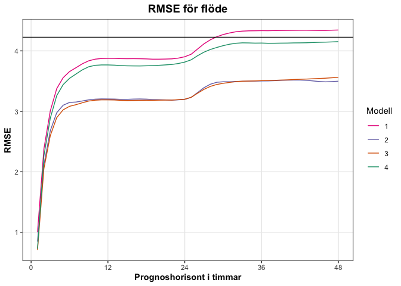

Figuren visar träffsäkerheten för de fyra ARMAX-modellerna den linjära
regressionsmodellen utan AR med lägst RMSE värde, vilket är modellen 3.
Alla fyra linjära regressionsmodeller blir mer träffsäkra när AR läggs
till, där även tre av dem är bättre på att prediktera flöde två dygn in
i framtiden. Den sista modellen är bättre på att prediktera 30 timmar,
men efter det så är dem mindre träffsäkra än den linjära
regressionsmodellen. En kan även se att de två bästa modellerna som i
stort sätt följer varandra och har linkande RMSE-värde på sina
observationer är modell 2 och 3. Mellan 6 och 24 timmar samt 30 till 48
timmar framåt så är det inte några större skillnader för de fyra
modellernas träffsäkerhet.

    amape.enkel.f <- amape_func(n.enkel.f, 48, alla.hours$flow, 1488, 29064, 30552, pred.enkel.f)
    amape.month.f <- amape_func(n.month.f, 48, alla.hours$flow, 1488, 29064, 30552, pred.month.f)
    amape.m.tid.f <- amape_func(n.m.tid.f, 48, alla.hours$flow, 1488, 29064, 30552, pred.m.tid.f)
    amape.tid.f <- amape_func(n.tid.f, 48, alla.hours$flow, 1488, 29064, 30552, pred.tid.f)

    ## Bästa modellen har AMAPE = 15.75445 % (Modell 3)
    ## ((1/1488) * sum(abs(pred.m.tid.f - veri.data$flow)  /
    ##                      ((1/1488) * sum(veri.data$flow)))) * 100

    amape.f <- data.frame("y" = c(amape.enkel.f, amape.month.f, amape.m.tid.f, amape.tid.f),
                         "tid" = c(rep(1:48, 4)), "Modell" = c(rep("1", 48), rep("2", 48), 
                                                               rep("3", 48), rep("4", 48)))
    ggplot(amape.f) +
      aes(x= tid, y = y, color = Modell) +
      geom_line() +
      theme_bw() +
      labs(title = "AMAPE för flöde",
           y = "AMAPE", x = "Prognoshorisont i timmar") +
      theme(axis.title.y = element_text(size = 11, face = "bold"),
            axis.title.x = element_text(size = 11, face = "bold"),
            plot.title = element_text(hjust = 0.5, size = 14, face = "bold"),
            panel.grid.minor = element_blank()) +
      scale_x_continuous(breaks = seq(0, 48, 12)) +
      scale_color_manual(values = rev(brewer.pal(length(levels(amape.f$Modell)), "Dark2"))) +
      geom_hline(yintercept=15.75445)

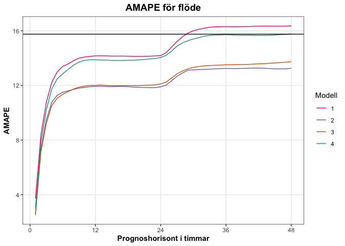

I figuren kan en se AMAPE för de fyra ARMAX-modellerna samt den linjära
regressionsmodellen utan AR, vilket är modell 3. Figuren liknar
föregående figur, där modell 2 och 3 är de bästa modellerna enligt
jämförelsemåttet och följer varandra till stor del. Mellan 10 och 24
timmar fram så har modell 2 och 3 AMAPE värde omkring 12 procent, och
mellan 30 och 48 timmar omkring 13-14 procent, där modell 2 är något
bättre efter 30 timmar. Precis som visas i figur 4.1, är det inte några
större skillnader på träffsäkerheten mellan träffsäkerheten mellan 6 och
24 timmar samt mellan 30 och 48 timmar fram i tiden för de fyra
modellerna.

    tic.enkel.f <- tic_func(n.enkel.f, 48, alla.hours$flow, 1488, 29064, 30552, pred.enkel.f)
    tic.month.f <- tic_func(n.month.f, 48, alla.hours$flow, 1488, 29064, 30552, pred.month.f)
    tic.m.tid.f <- tic_func(n.m.tid.f, 48, alla.hours$flow, 1488, 29064, 30552, pred.m.tid.f)
    tic.tid.f <- tic_func(n.tid.f, 48, alla.hours$flow, 1488, 29064, 30552, pred.tid.f)

    ## Bästa modellen har TIC = 0.09233263 (Modell 4)
    ## sqrt((1/1488) * sum((pred.m.tid.f - veri.data$flow)^2)) /
    ##   (sqrt((1/1488) * sum((pred.m.tid.f)^2)) + 
    ##      sqrt((1/1488) * sum((veri.data$flow)^2)))

    tic.f <- data.frame("y" = c(tic.enkel.f, tic.month.f, tic.m.tid.f, tic.tid.f),
                        "tid" = c(rep(1:48, 4)), "Modell" = c(rep("1", 48), rep("2", 48), 
                                                              rep("3", 48), rep("4", 48)))
    ggplot(tic.f) +
      aes(x= tid, y = y, color = Modell) +
      geom_line() +
      theme_bw() +
      labs(title = "TIC för flöde",
           y = "TIC", x = "Prognoshorisont i timmar") +
      theme(axis.title.y = element_text(size = 11, face = "bold"),
            axis.title.x = element_text(size = 11, face = "bold"),
            plot.title = element_text(hjust = 0.5, size = 14, face = "bold"),
            panel.grid.minor = element_blank()) +
      scale_x_continuous(breaks = seq(0, 48, 12)) +
      scale_color_manual(values = rev(brewer.pal(length(levels(tic.f$Modell)), "Dark2"))) +
      geom_hline(yintercept=0.09233263)

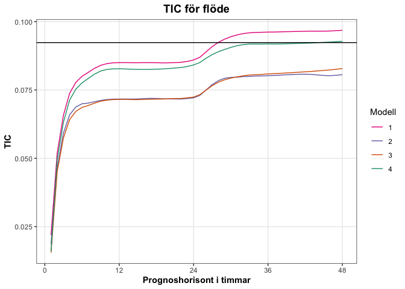

Figuren visar TIC för de fyra ARMAX-modellerna samt den linjära
regressionsmodellen utan AR, vilket är modell 4. Figuren liknar både
föregående figurerna, där modell 2 och 3 är även bäst enligt TIC. Där
modell 2 blir bättre än modell 3 runt omkring 40 timmar och framåt. Alla
fyra modeller följer även i helhet samma mönster som i de två
föregående, att det inte är några större skillnader i träffsäkerheten
mellan 6 och 24 timmar samt mellan 30 och 48 timmar framåt.

    acfs.month.e <- data.frame("ACF" = c(acf(ts.tr.month.e, lag.max = 336, type = "cov", plot = FALSE)[[1]],
                                         tacvfARMA(phi = ar.month.e$coef,maxLag = 336,sigma2 = ar.month.e$sigma2)),
                               "Lag" = c(rep(1:337, 2)), "Modell" = c(rep("ACF", 337), rep("Empirisk ACF", 337)))
    ggplot(acfs.month.e) +
      aes(x= Lag, y = ACF, color = Modell) +
      geom_line() +
      theme_bw() +
      labs(title = "Modell 2") +
      theme(axis.title.y = element_text(size = 11, face = "bold"),
            axis.title.x = element_text(size = 11, face = "bold"),
            plot.title = element_text(hjust = 0.5, size = 14, face = "bold"),
            panel.grid.minor = element_blank()) +
      scale_x_continuous(breaks = seq(0, 337, 24)) +
      scale_y_continuous(breaks = seq(-10000, 49000, 10000)) +
      scale_color_manual(name = "AR ACF", values = rev(brewer.pal(length(levels(acfs.month.e$Modell)), "Oranges")))

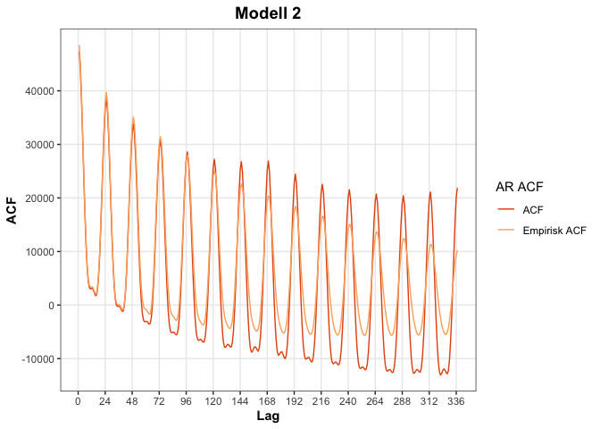

Autokovariansen för figuren visar ett tydligt säsongsvariation mönster
för dem bägge autokovarianserna. Det finns även en stark korrelation var
24:e lag mot den nuvarande laggen. Vi kan även se att de är tydligt att
datan är korrelerad var 24:e lag på 336 punkter. Det verkar rätt så
troligt då det betyder att den aktuella timmen delar en hög korrelation
med samma timme från förgående dag. Detta leder till att en kan
sammanfatta det som att timdatan visar bevis på dagligavariationer.

    spec.ar.month.e <- data.frame("Spektraltäthet" = spec.ar(ts.tr.month.e, order = 48, log = "no", plot = FALSE)$spec,
                                  "Timmar" = spec.ar(ts.tr.month.e, order = 47, log = "no", plot = FALSE)[[1]] * 24)
    ggplot(spec.ar.month.e) +
      aes(x = Timmar, y = Spektraltäthet) +
      geom_line(color = "dark orange") +
      theme_bw() +
      labs(title = "Spektraltäthet för modell 2") +
      theme(axis.title.y = element_text(size = 11, face = "bold"),
            axis.title.x = element_text(size = 11, hjust = 0.5, face = "bold"),
            plot.title = element_text(hjust = 0.5, size = 14, face = "bold"),
            panel.grid.minor = element_blank()) +
      scale_x_continuous(breaks = seq(0, 288, 24))

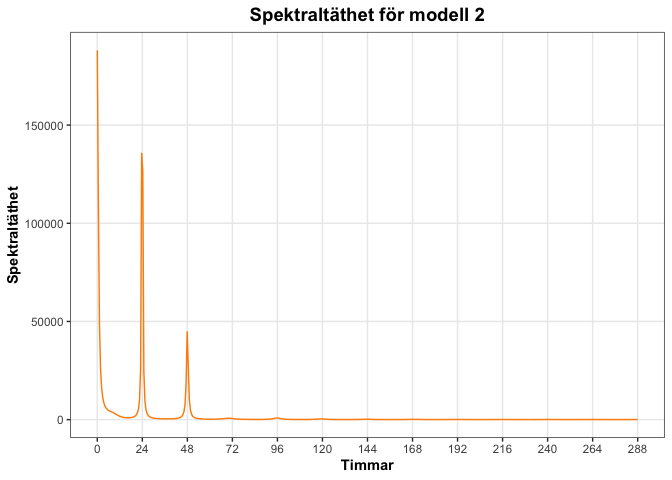

Figuren visar spektraltätheten som visar frekvenser i dygn. Toppen vid 0
indikerar på en stark korrelation mellan närliggande toppar. Det finns
även ett periodisk mönster vid 24 timmar och sedan ett svagare
periodiskt mönster vid 48.

Energi
------

De AR-modeller som har haft bäst BIC-värde för de fyra modellerna när
energi är responsvariabel är:

Modell 1: AR(47)

Modell 2: AR(48)

Modell 3: AR(28)

Modell 4: AR(27)

    ts.tr.enkel.e <- ts(tr.enkel.e$residuals, start = c(1,1),  frequency = 24)
    ts.tr.month.e <- ts(tr.month.e$residuals, start = c(1,1),  frequency = 24)
    ts.tr.m.tid.e <- ts(tr.m.tid.e$residuals, start = c(1,1),  frequency = 24)
    ts.tr.tid.e <- ts(tr.tid.e$residuals, start = c(1,1),  frequency = 24)
    ar.enkel.e.test <- ar(ts.tr.enkel.e, AIC = TRUE, order.max = 48, method = "yule-walker")
    ar.enkel.e.test$aic - 2 * k + log(29064) * k
    ## AR(47)

    ar.month.e.test <- ar(ts.tr.month.e, AIC = FALSE, order.max = 48, method = "yule-walker")
    ar.month.e.test$aic - 2 * k + log(29064) * k
    ## AR(48)

    ar.m.tid.e.test <- ar(ts.tr.m.tid.e, AIC = FALSE, order.max = 48, method = "yule-walker")
    ar.m.tid.e.test$aic - 2 * k + log(29064) * k
    ## AR(28)

    ar.tid.e.test <- ar(ts.tr.tid.e, AIC = FALSE, order.max = 48, method = "yule-walker")
    ar.tid.e.test$aic - 2 * k + log(29064) * k
    ## AR(27)

    ar.enkel.e <- Arima(ts.tr.enkel.e, order = c(47,0,0))
    ar.month.e <- Arima(ts.tr.month.e, order = c(48,0,0))
    ar.m.tid.e <- Arima(ts.tr.m.tid.e, order = c(28,0,0))
    ar.tid.e <- Arima(ts.tr.tid.e, order = c(27,0,0))

Precis som i flöde så för att se vilken eller vilka av de fyra
modellerna som ger bäst prediktioner på testdatan så jämförs igen de
fyra modellernas RMSE, AMAPE och TIC värden. Även här så jämförs de fyra
kombinerade modellerna med den den linjära regressionsmodellen med bäst
jämförelsemått.

    pred.enkel.e <- rowSums(data.frame(rep(coef(tr.enkel.e)[1], 1488), rep(coef(tr.enkel.e)[2], 1488)) * 
                              veri.enkel)
    res.enkel.e <- ts(c(tr.enkel.e$residuals, (pred.enkel.e-veri.data$power)), start = c(1,1), frequency = 24)

    pred.month.e <- rowSums(data.frame(rep(coef(tr.month.e)[1], 1488), rep(coef(tr.month.e)[2], 1488), 
                                       rep(coef(tr.month.e)[5], 1488), rep(coef(tr.month.e)[6], 1488), 
                                       rep(coef(tr.month.e)[7], 1488)) * veri.month)
    res.month.e <- ts(c(tr.month.e$residuals, (pred.month.e-veri.data$power)), start = c(1,1), frequency = 24)

    pred.m.tid.e <- rowSums(data.frame(rep(coef(tr.m.tid.e)[1], 1488), rep(coef(tr.m.tid.e)[2], 1488), 
                                       rep(coef(tr.m.tid.e)[5], 1488), rep(coef(tr.m.tid.e)[6], 1488),
                                       rep(coef(tr.m.tid.e)[7], 1488), rep(coef(tr.m.tid.e)[14], 1488),
                                       rep(coef(tr.m.tid.e)[15], 1488), rep(coef(tr.m.tid.e)[16], 1488),
                                       rep(coef(tr.m.tid.e)[17], 1488), rep(coef(tr.m.tid.e)[18], 1488),
                                       rep(coef(tr.m.tid.e)[19], 1488), rep(coef(tr.m.tid.e)[20], 1488),
                                       rep(coef(tr.m.tid.e)[21], 1488), rep(coef(tr.m.tid.e)[22], 1488),
                                       rep(coef(tr.m.tid.e)[23], 1488), rep(coef(tr.m.tid.e)[24], 1488),
                                       rep(coef(tr.m.tid.e)[25], 1488), rep(coef(tr.m.tid.e)[26], 1488),
                                       rep(coef(tr.m.tid.e)[27], 1488), rep(coef(tr.m.tid.e)[28], 1488),
                                       rep(coef(tr.m.tid.e)[29], 1488), rep(coef(tr.m.tid.e)[30], 1488),
                                       rep(coef(tr.m.tid.e)[31], 1488), rep(coef(tr.m.tid.e)[32], 1488),
                                       rep(coef(tr.m.tid.e)[33], 1488), rep(coef(tr.m.tid.e)[34], 1488),
                                       rep(coef(tr.m.tid.e)[35], 1488), rep(coef(tr.m.tid.e)[36], 1488)) * 
                              veri.m.tid)
    res.m.tid.e <- ts(c(tr.m.tid.e$residuals, (pred.m.tid.e-veri.data$power)), start = c(1,1), frequency = 24)

    pred.tid.e <- rowSums(data.frame(rep(coef(tr.tid.e)[1], 1488), rep(coef(tr.tid.e)[2], 1488), 
                                     rep(coef(tr.tid.e)[3], 1488), rep(coef(tr.tid.e)[4], 1488),
                                     rep(coef(tr.tid.e)[5], 1488), rep(coef(tr.tid.e)[6], 1488),
                                     rep(coef(tr.tid.e)[7], 1488), rep(coef(tr.tid.e)[8], 1488),
                                     rep(coef(tr.tid.e)[9], 1488), rep(coef(tr.tid.e)[10], 1488),
                                     rep(coef(tr.tid.e)[11], 1488), rep(coef(tr.tid.e)[12], 1488),
                                     rep(coef(tr.tid.e)[13], 1488), rep(coef(tr.tid.e)[14], 1488),
                                     rep(coef(tr.tid.e)[15], 1488), rep(coef(tr.tid.e)[16], 1488),
                                     rep(coef(tr.tid.e)[17], 1488), rep(coef(tr.tid.e)[18], 1488),
                                     rep(coef(tr.tid.e)[19], 1488), rep(coef(tr.tid.e)[20], 1488),
                                     rep(coef(tr.tid.e)[21], 1488), rep(coef(tr.tid.e)[22], 1488),
                                     rep(coef(tr.tid.e)[23], 1488), rep(coef(tr.tid.e)[24], 1488),
                                     rep(coef(tr.tid.e)[25], 1488)) * veri.tid)
    res.tid.e <- ts(c(tr.tid.e$residuals, (pred.tid.e-veri.data$power)), start = c(1,1), frequency = 24)

    n.enkel.e <- n_step(ar.enkel.e, 48, res.enkel.e, 1488, 29064)
    n.month.e <- n_step(ar.month.e, 48, res.month.e, 1488, 29064)
    n.m.tid.e <- n_step(ar.m.tid.e, 48, res.m.tid.e, 1488, 29064)
    n.tid.e <- n_step(ar.tid.e, 48, res.tid.e, 1488, 29064)

    rmse.enkel.e <- rmse_func(n.enkel.e, 48, alla.hours$power, 1488, 29064, 30552, pred.enkel.e)
    rmse.month.e <- rmse_func(n.month.e, 48, alla.hours$power, 1488, 29064, 30552, pred.month.e)
    rmse.m.tid.e <- rmse_func(n.m.tid.e, 48, alla.hours$power, 1488, 29064, 30552, pred.m.tid.e)
    rmse.tid.e <- rmse_func(n.tid.e, 48, alla.hours$power, 1488, 29064, 30552, pred.tid.e)

    ## Bästa modellen har RMSE = 153.84 (Modell 3)
    ## RMSE(pred.m.tid.e, veri.data$power)

    rmse.e <- data.frame("y" = c(rmse.enkel.e, rmse.month.e, rmse.m.tid.e, rmse.tid.e),
                         "tid" = c(rep(1:48, 4)), "Modell" = c(rep("1", 48), rep("2", 48), 
                                                               rep("3", 48), rep("4", 48)))
    ggplot(rmse.e) +
      aes(x= tid, y = y, color = Modell) +
      geom_line() +
      theme_bw() +
      labs(title = "RMSE för energi",
           y = "RMSE", x = "Prognoshorisont i timmar") +
      theme(axis.title.y = element_text(size = 11, face = "bold"),
            axis.title.x = element_text(size = 11, face = "bold"),
            plot.title = element_text(hjust = 0.5, size = 14, face = "bold"),
            panel.grid.minor = element_blank()) +
      scale_x_continuous(breaks = seq(0, 48, 12)) +
      scale_color_manual(values = rev(brewer.pal(length(levels(rmse.e$Modell)), "Dark2"))) +
      geom_hline(yintercept=153.84)

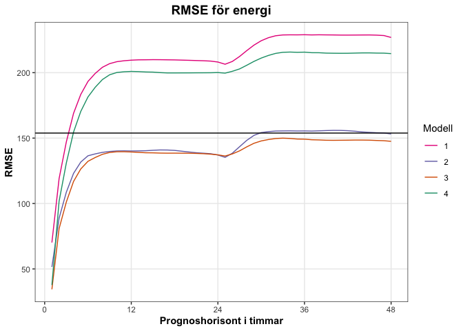

Figuren visar träffsäkerheten för de fyra kombinationerna samt den
linjära regressionsmodellen med lägst RMSE värde, vilket är
regressionsmodellen med temperatur, månad och timme som
förklaringsvariabler. En kan se att när AR läggs till de olika linjära
regressionsmodellerna så ökar träffsäkerheten, men det är inte lika stor
skillnad som i figuren för RMSE för flöde. Vid 30 fram till 48 steg fram
i tiden så är modellerna nästan lika bra som den ensamma linjära
regressionsmodellen.

    amape.enkel.e <- amape_func(n.enkel.e, 48, alla.hours$power, 1488, 29064, 30552, pred.enkel.e)
    amape.month.e <- amape_func(n.month.e, 48, alla.hours$power, 1488, 29064, 30552, pred.month.e)
    amape.m.tid.e <- amape_func(n.m.tid.e, 48, alla.hours$power, 1488, 29064, 30552, pred.m.tid.e)
    amape.tid.e <- amape_func(n.tid.e, 48, alla.hours$power, 1488, 29064, 30552, pred.tid.e)

    ## Bästa modellen har AMAPE = 16.55618 % (Modell 3)
    ## ((1/1488) * sum(abs(pred.m.tid.e - veri.data$power)  /
    ##                   ((1/1488) * sum(veri.data$power)))) * 100

    amape.e <- data.frame("y" = c(amape.enkel.e, amape.month.e, amape.m.tid.e, amape.tid.e),
                          "tid" = c(rep(1:48, 4)), "Modell" = c(rep("1", 48), rep("2", 48), 
                                                                rep("3", 48), rep("4", 48)))
    ggplot(amape.e) +
      aes(x= tid, y = y, color = Modell) +
      geom_line() +
      theme_bw() +
      labs(title = "AMAPE för energi",
           y = "AMAPE", x = "Prognoshorisont i timmar") +
      theme(axis.title.y = element_text(size = 11, face = "bold"),
            axis.title.x = element_text(size = 11, face = "bold"),
            plot.title = element_text(hjust = 0.5, size = 14, face = "bold"),
            panel.grid.minor = element_blank()) +
      scale_x_continuous(breaks = seq(0, 48, 12)) +
      scale_color_manual(values = rev(brewer.pal(length(levels(amape.e$Modell)), "Dark2"))) +
      geom_hline(yintercept=16.55618)

I figuren kan en se AMAPE för de fyra kombinationerna samt samma linjära
regressionsmodell som i föregående figur. En kan se skillnader att
istället för marginellt bättre så överlappar modell 3 sin multipel
linjära regressionsmodell vid 30 till 48 timmarna framåt, där de har ett
värde omkring 16.5 procent. Däremot är både modell 2 och 3 bättre på att
prediktera energiförbrukning än den linjära regressionsmodellen fram
till dess.

    tic.enkel.e <- tic_func(n.enkel.e, 48, alla.hours$power, 1488, 29064, 30552, pred.enkel.e)
    tic.month.e <- tic_func(n.month.e, 48, alla.hours$power, 1488, 29064, 30552, pred.month.e)
    tic.m.tid.e <- tic_func(n.m.tid.e, 48, alla.hours$power, 1488, 29064, 30552, pred.m.tid.e)
    tic.tid.e <- tic_func(n.tid.e, 48, alla.hours$power, 1488, 29064, 30552, pred.tid.e)

    ## Bästa modellen har TIC = 0.09640769 (Modell 3)
    ## sqrt((1/1488) * sum((pred.m.tid.e - veri.data$power)^2)) /
    ##   (sqrt((1/1488) * sum((pred.m.tid.e)^2)) + 
    ##      sqrt((1/1488) * sum((veri.data$power)^2)))

    tic.e <- data.frame("y" = c(tic.enkel.e, tic.month.e, tic.m.tid.e, tic.tid.e),
                        "tid" = c(rep(1:48, 4)), "Modell" = c(rep("1", 48), rep("2", 48), 
                                                              rep("3", 48), rep("4", 48)))
    ggplot(tic.e) +
      aes(x= tid, y = y, color = Modell) +
      geom_line() +
      theme_bw() +
      labs(title = "TIC för energi",
           y = "TIC", x = "Prognoshorisont i timmar") +
      theme(axis.title.y = element_text(size = 11, face = "bold"),
            axis.title.x = element_text(size = 11, face = "bold"),
            plot.title = element_text(hjust = 0.5, size = 14, face = "bold"),
            panel.grid.minor = element_blank()) +
      scale_x_continuous(breaks = seq(0, 48, 12)) +
      scale_color_manual(values = rev(brewer.pal(length(levels(tic.e$Modell)), "Dark2"))) +
      geom_hline(yintercept=0.09640769)

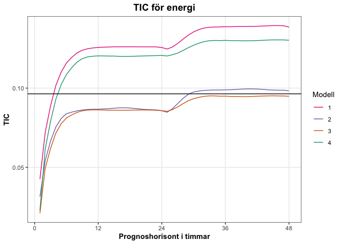

Figuren visar TIC för de fyra kombinationerna samt samma linjära
regressionsmodell som i föregående två figurer. Precis som i dessa är
det inte så stor skillnad på träffsäkerheten mellan 30 till 48 timmar
framåt, men modell 3 är marginellt bättre. Det är däremot en större
skillnad fram till 30 timmar framåt, där både modell 2 och 3 är bättre
än den linjära regressionsmodellen.

    acfs.m.tid.e <- data.frame("ACF" = c(acf(ts.tr.m.tid.e, lag.max = 336, type = "cov", plot = FALSE)[[1]],
                                         tacvfARMA(phi = ar.m.tid.e$coef,maxLag = 336,sigma2 = ar.m.tid.e$sigma2)),
                               "Lag" = c(rep(1:337, 2)), "Modell" = c(rep("ACF", 337), rep("Empirisk ACF", 337)))
    ggplot(acfs.m.tid.e) +
      aes(x= Lag, y = ACF, color = Modell) +
      geom_line() +
      theme_bw() +
      labs(title = "Modell 3") +
      theme(axis.title.y = element_text(size = 11, face = "bold"),
            axis.title.x = element_text(size = 11, face = "bold"),
            plot.title = element_text(hjust = 0.5, size = 14, face = "bold"),
            panel.grid.minor = element_blank()) +
      scale_x_continuous(breaks = seq(0, 337, 24)) +
      scale_y_continuous(breaks = seq(0, 26000, 5000)) +
      scale_color_manual(name = "AR ACF", values = rev(brewer.pal(length(levels(acfs.m.tid.e$Modell)), "Oranges")))

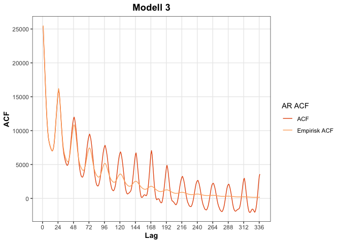

Autokovariansen och den empiriska följer varandra relativt bra dock har
den svårt att följa med autokovariansen ju längre fram man går i laggen.
Vilket beror på att en del av dygnsvariationen modelleras med
regressionsparametrar, och därför försvinner lite av det periodiska
mönstret. Figuren visar även tecken på säsongsvariation då det är toppar
var 24:e lag i autokovariansen.

    spec.ar.m.tid.e <- data.frame("Spektraltäthet" = spec.ar(ts.tr.m.tid.e, order = 28, log = "no", plot = FALSE)$spec,
                                  "Timmar" = spec.ar(ts.tr.m.tid.e, order = 47, log = "no", plot = FALSE)[[1]] * 24)
    ggplot(spec.ar.m.tid.e) +
      aes(x = Timmar, y = Spektraltäthet) +
      geom_line(color = "dark orange") +
      theme_bw() +
      labs(title = "Spektraltäthet för modell 3") +
      theme(axis.title.y = element_text(size = 11, face = "bold"),
            axis.title.x = element_text(size = 11, hjust = 0.5, face = "bold"),
            plot.title = element_text(hjust = 0.5, size = 14, face = "bold"),
            panel.grid.minor = element_blank()) +
      scale_x_continuous(breaks = seq(0, 288, 24))

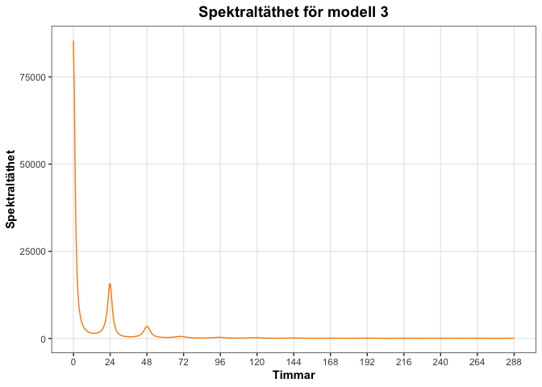

Figur 4.12 visar spektraltätheten för modell 3. Som synes i figuren
finns det en dominerande topp vid 0 vilket indikerar på en stark
korrelation mellan närliggande punkter. Det finns även ett periodiskt
mönster vid 24 timmar och vid 48 timmar ett svagare periodiskt mönster.

Diskussion
==========

Problem som kan uppstå med modellerna, är att de bygger mycket på
temperatur, vilket inte går att veta säkert i verkligheten utanför en
undersökning. Detta betyder att vid ‘’riktiga’’ prediktioner kommer
osäkerheten vara större än vad de har haft i våra tester. Då alla
modeller med temperatur som variabel behöver en prediktion för
temperaturen, där den kommer ha en viss osäkerhet. I vårt datamaterial
har vi använt oss av den sanna temperaturen vilket inte ger samma
osäkerhet.

Problem som också uppkommer med modellerna är att det finns variabler
som inte har blivit uppmätta, eftersom de sociala variablerna påverkar
förbrukningen av energi och flöde. Sociala variabler kan vara såsom
antal personer i hushållet, tiden de spenderar där och vad de gör. De
sociala variablerna kan däremot vara svåra att mäta och kan även
intränga på en kunds integritet. En variabel som även är påvisad att den
påverkar flöde och energi är vindhastighet och solljus. En modell som
även har vindhastighet och solljus bör därför kunna skapa bättre
prediktioner för energi och flöde. Då flöde är en kovariat till energi
skulle den även kunna tas med i energimodellerna om man kan uppnå en
bättre precision på prediktionerna för flöde. Det kan även vara så att
de inte påverkar prediktionerna på ett signifikant positivt sätt, då
helg som variabel har visats i tidigare forskning vara signifikant, men
är inte det i detta datamaterial.

Tidigare forskning har visat även i sina undersökningar att de får en
bättre prediktion när de delar upp sitt datamaterial i två delar, ett
för sommar- och ett för vinterhalvåret. I uppsatsen har vi istället valt
att modellera in månad som dummy variabel i hopp om att fånga upp detta.
Vi ser i resultatet för båda modellerna att dessa dummy variabler gör
modellerna bättre på att prediktera än de modellerna som saknar dessa,
vilket stämmer överrens med tidigare forskning.

Man skulle även kunna göra interaktionstermer med temperatur och månader
även temperatur och timmar då de kan anses ha en kombinerande effekt på
flöde och energi. Detta kan vara en bra sak att ta med då man får en
bättre förståelse och representation i förhållandet mellan de oberoende
variablerna och den beroende variabeln. Dessutom kan det förklara
variationen bättre i den beroende variabeln.

I den här uppsatsen så har vi valt att avgränsa oss till linjära
modeller, men icke linjära modeller såsom neurala nätverk skulle kunna
prediktera energi och flöde med en högre ackuratess. Tidigare studier
visar att neurala nätverk är starkare på att prediktera toppar och dalar
än linjära modeller, vilket skulle kunna ge bättre prediktioner. Det
finns även forskning som har visat att även neurala nätverk och
ARIMA-modeller går att kombineras för att skapa mer träffsäkra
prediktioner

Slutsatser
==========

De modeller som predikterar flöde bäst är modellerna 2 och 3. Modell 2
är en linjär regressionsmodell med temperatur och månad som
förklaringsvariabler kombinerat med en AR(47)-modell och modell 3 är en
linjär regressionsmodell med temperatur, månad och timme som
förklaringsvariabler kombinerat med en AR(28)-modell. Båda av dessa gör
ett bra jobb att prediktera 6 till 24 timmar framåt i tiden med ett
genomsnittsfel på omkring 12 procent och 30 till 48 timmar framåt i
tiden med ett genomsnittsfel på omkring 13-14 procent. Om en modell är
att föredra är det modell 2, som gör marginellt bättre prediktioner än
modell 3. Samtliga modeller för flöde är tydligt bättre på att
prediktera fram till ca. 30 timmmar sedan avviker modell 1 och 4 i
jämförelse med den linjära regressionen.

Den modell som predikterar energi bäst är också modell 3, vilket är en
linjär regressionsmodell med temperatur, månad och timme som
förklaringsvariabler kombinerat med en AR(28)-modell. Den är något sämre
än modellerna för flöde, då den har ett genomsnittsfel på omkring 15
procent i prediktioner 6 till 24 timmar i framtiden. Efter 30 timmar
fram till 48 timmar i framtiden är ARMAX-modellen överflödig, en modell
med endast linjär regression har samma träffsäkerhet under dessa timmar.
Men som helhet är både modell 2 och 3 tydligt bättre de 30 första
timmarna än en modell med endast linjär regression. Även modell 1 och
modell 4 har bättre träffsäkerhet de första ca. 5 timmarna än med endast
linjär regression.
